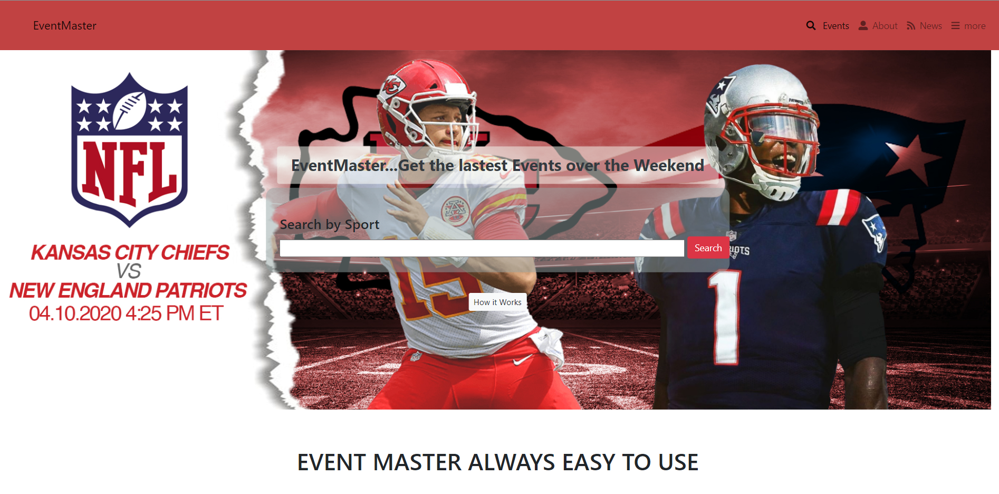

# Directory Of Events

> Capstone Project The Directory of Events

This project is based on a directory of events that will display back to the
user the list of sports events for the current day the day after and also
over the weeekend.

## Built With

- HTML
- CSS
- Bootstrap

## Live Demo

[Live Demo Link](https://cvilla714.github.io/htmlcapstoneproject/index.html)

## Getting Started

To get a local copy up and running follow these simple example steps.

### Prerequisites

### Setup

### Install

### Usage

### Run tests

### Deployment

## Authors

👤 **Devkc**

- Github: [@githubhandle](https://github.com/cvilla714)
- Twitter: [@twitterhandle](https://twitter.com/kckeyti)
- Linkedin: [linkedin](https://www.linkedin.com/in/cosmel-villalobos-1900531aa/)

## 🤝 Contributing

Contributions, issues, and feature requests are welcome!

Feel free to check the [issues page](issues/).

## Show your support

Give a ⭐️ if you like this project!

## Acknowledgments

- Hat tip to anyone whose code was used
- Inspiration
- etc

## 📝 License

-Inspired on the Mathew Njuguna patashuleKE design -https://www.behance.net/gallery/25563385/PatashuleKE
